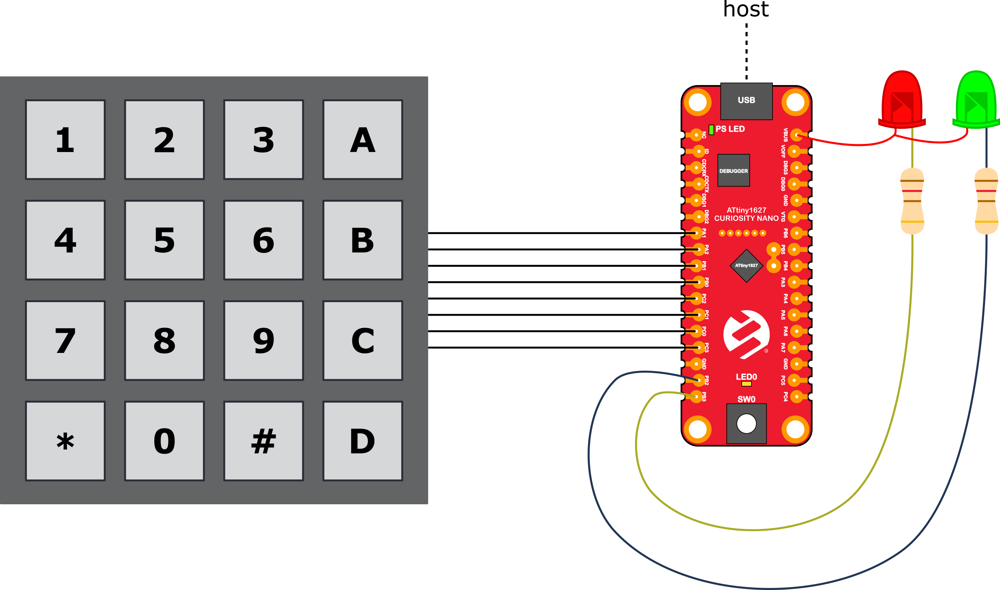

# AN3407 - Using Matrix Keypad With AVR® Devices

This application note shows how a general keypad application can be implemented with tinyAVR® and megaAVR® devices. A conceptual overview of the operation of a matrix keypad and two demo applications are presented. One demo shows a simple implementation of a keypad, while the second demo uses more advanced features to make the application more efficient and use less power.

The examples in this application note may easily be changed to interface a smaller or larger matrix keypad, and are easy to implement into another application. The application may be used in all implementations using a matrix keypad, such as access control keypads, keyboards, or remote controls.

## Related Documentation

<!-- Any information about an application note or tech brief can be linked here. Use unbreakable links! -->
The application note explaining the concepts used in this repository can be found at https://microchip.com/DS00003407.

## Software Used

<!-- All software used in this example must be listed here. Use unbreakable links! -->

## Hardware Used

<!-- All hardware used in this example must be listed here. Use unbreakable links! -->

## Setup

* Connect the keypad to the ATmega1627 Curiosity Nano as follows:
  * Row 0: PB0
  * Row 1: PB1
  * Row 2: PA2
  * Row 3: PA1
  * Column 0: PC3
  * Column 1: PC0
  * Column 2: PC1
  * Column 3: PC2
* Connect the red LED to PB3 and the green LED to PB2

## Operation

* Connect the ATtiny1627 Curiosity Nano to a computer using a USB cable
* Download the application and program it to the ATtiny1627 Curiosity Nano
* The pin-code “123ABC” is programmed to be the passcode. Try pressing this code followed by pound (#) to observe the green LED flashing. Try a different code to observe the red LED flashing.

## Conclusion

<!-- Summarize what the example has shown -->