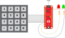

# AN3407 - Using Matrix Keypad With AVR® Devices

This application note shows how a general keypad application can be implemented with tinyAVR® and megaAVR® devices. A conceptual overview of the operation of a matrix keypad and two demo applications are presented. One demo shows a simple implementation of a keypad, while the second demo uses more advanced features to make the application more efficient and use less power.

The examples in this application note may easily be changed to interface a smaller or larger matrix keypad, and are easy to implement into another application. The application may be used in all implementations using a matrix keypad, such as access control keypads, keyboards, or remote controls.

## Related Documentation

* [AN3407 - Using Matrix Keypad With AVR® Devices](https://microchip.com/DS00003407)
* [ATtiny1627 device page](https://www.microchip.com/wwwproducts/en/ATTINY1627)

## Software Used
* [Atmel Studio](https://www.microchip.com/mplab/avr-support/atmel-studio-7) 7.0.2397 or later
* Atmel Studio ATtiny_DFP version 1.4.308 or later

## Hardware Used
* [Microchip ATtiny1627 Curiosity Nano Evaluation Kit](https://www.microchip.com/developmenttools/ProductDetails/DM080104)
* A 4x4 Matrix Keypad
* Two LEDs
* Two resistors
* Micro-USB cable (Type-A/Micro-B)

## Setup

* Connect the keypad to the ATmega1627 Curiosity Nano as follows:
  * Row 0: PB0
  * Row 1: PB1
  * Row 2: PA2
  * Row 3: PA1
  * Column 0: PC3
  * Column 1: PC0
  * Column 2: PC1
  * Column 3: PC2
* Connect the green LED and a resistor in series between VTG and PB2
* Connect the red LED and a resistor in series between VTG and PB3

## Operation

* Connect the ATtiny1627 Curiosity Nano to a computer using the USB cable
* Download the zip file or clone the example to get the source code
* Open the .atsln file with Atmel Studio
* Choose one of the two code projects and program the ATtiny1627
* The pin-code “123ABC” is programmed to be the passcode. Try pressing this code followed by pound (#) to observe the green LED flashing. Try a different code to observe the red LED flashing.

## Conclusion

This example has shown two ways of implementing a matrix keypad with an AVR® microcontroller.